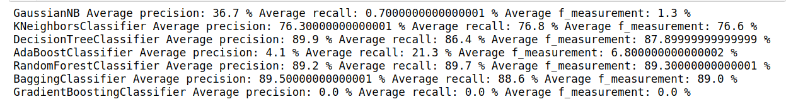
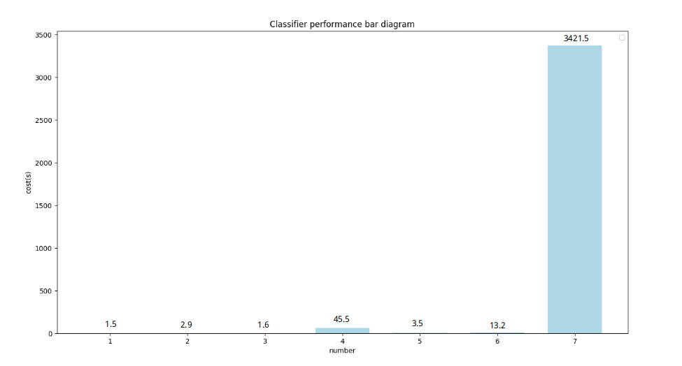

# Report

### 运行结果
##### 各个分类器的预测结果误差图

##### 准确度、召回率、F值

#### 性能比较图
##### 各个分类器运行时间比较

#### 讨论分析

- 误差分析
    - 由于训练集和测试集切分的缺陷，经过计算，每次测试集中将有2%左右（25个）的点的标签在训练集中不存在，这意味着这些点绝对会被标记为其它点，将存在系统上的误差。
    - 从结果中可以看到，GaussianNB、AdaBoostClassifier、GradientBoostingClassifier 分类器的三个指标相对较低，这意味着他们的准确度很低。
    - 在选择最大的 10 个样本栅格时，各个样本的点数可以看下图
    
    可以看到后面 8 个点的样本中点的数量小于 20，对于机器学习来说，这个样本数太少了，以至于无法有较大的准确度。
    - 高斯贝叶斯为什么效果并不好？
        数据并不符合高斯分布，高斯贝叶斯是基于高斯分布的概率模型，但不适用于非高斯分布的数据。GPS 数据明显不属于高斯分布，不适用于这种情况。
- 性能优化
    - 除了调整参数优化，本人还尝试将特征提取进行优化，例如，将信号强度进行转化，记原始为 p，则转化为 p = p + 100，若基站缺失，则信号强度标记为 0，结果如下
        - **precision**、**recall**、**f_measurement**
        
        - 预测结果误差图
        
    实验结果表明这种做法并没有太大的优势，GaussianNB 分类器指标有所提升，也只是细微提升，基于分类的话，对于连续的值如果只是简单的同加是没有多大意义的
- 性能分析
    - 从各个分类器运行时间来看，GradientBoostingClassifier 运行时间最长
    - 贝叶斯分类器 Recall 率过低，主要是因为很多实际在的点预测错误，导致高斯贝叶斯预测的准确率、召回率，F 值过低