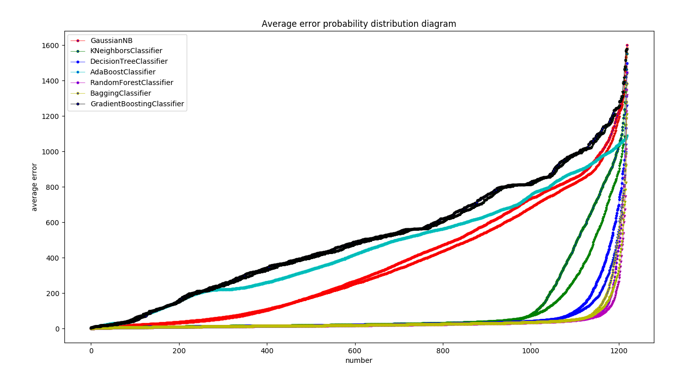
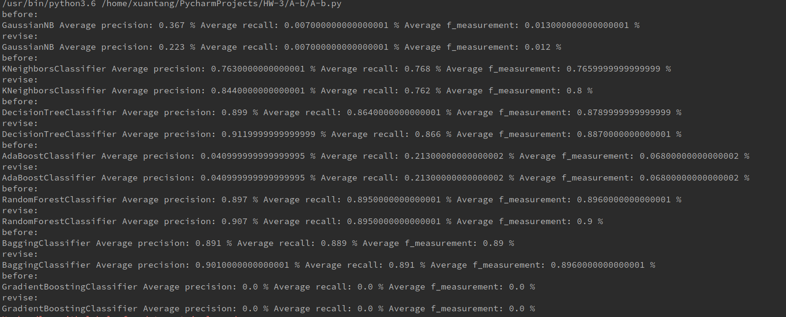
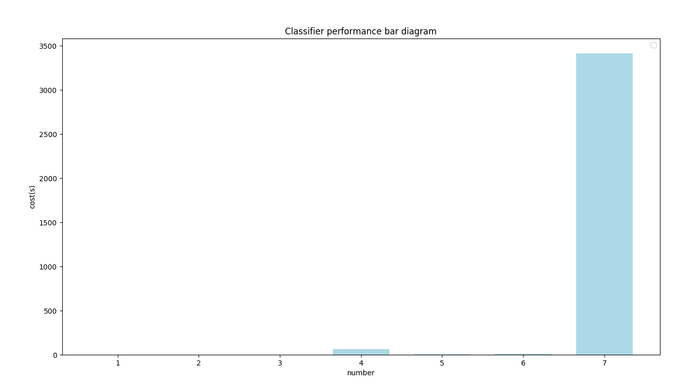

# Report

### 运行结果
##### 各个分类器的预测结果误差图

##### 准确度、召回率、F值

#### 性能比较图
##### 各个分类器运行时间比较

#### 讨论分析

##### 预测点修正方案
首次拿到预测的点以后，会将点进行分组，主要是为了区分不同的角色，然后每个角色的数据按照时间顺序进行排序，计算相邻两点之间的速度 v，当 v > threshold（可取 10 以上）时，理论上，若出现异常点，势必会出现连续的速度异常值，而中间的 n - 2 个点则为异常点，需要重新计算位置，根据该点的时间戳占比，计算一个平均速度的点作为修正点，修正点作为最终预测的点

算法图解

##### 结果分析
- 本人将修正后的图于修正前的图合并（同一颜色不同符号），从途中可以看出，修正后的折线偏低，说明误差已经大大降低，效果比较明显。
- 训练 10 次，修正后的 precision、recall、f_measurement 几乎都有所提升