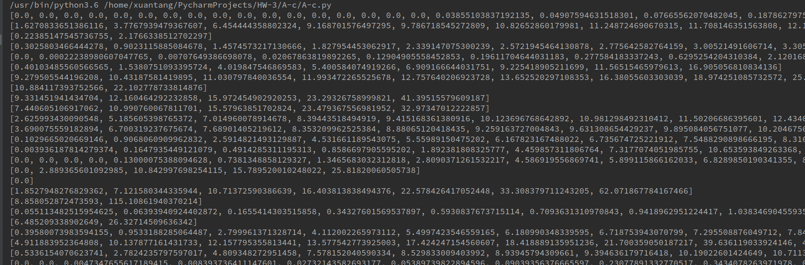
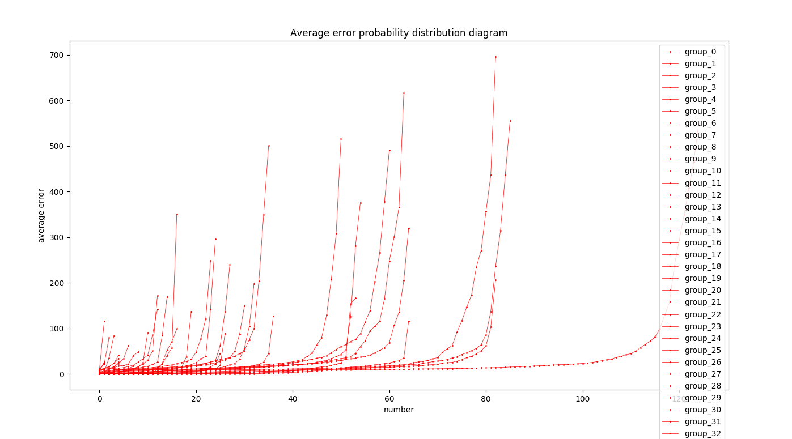
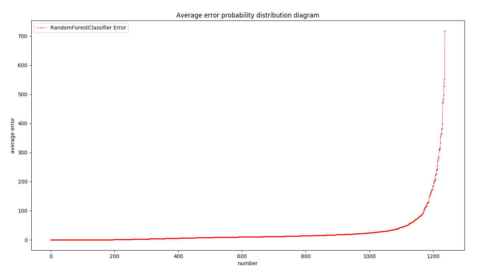
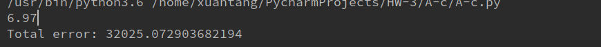

# Report

### 运行结果
##### 各个组的预测结果

##### 各个组的预测结果误差图

##### 总体的预测结果误差图

##### 总体误差

#### 性能比较图
##### 各个分类器运行时间比较
A-c 随机森林运行时间 6.79s
A-a 随机森林运行时间为1.2s
#### 讨论分析

##### 分组训练
- 从分组训练的误差来看，点数越多的分组，误差越小，有些点的误差几乎为 0，效果还不错。但是点数较少的分组，训练效果不是很好，主要原因在于训练样本过少
- 从总体误差结果来看，分组训练具有一定的优势，特别是一些点误差很小，几乎接近零，而使用栅格的方式只能使用栅格的中心替换预测位置，最小误差要比使用 GPS 相对位置要大

##### 结果分析
