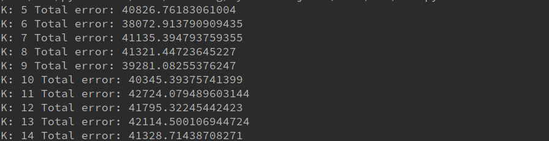
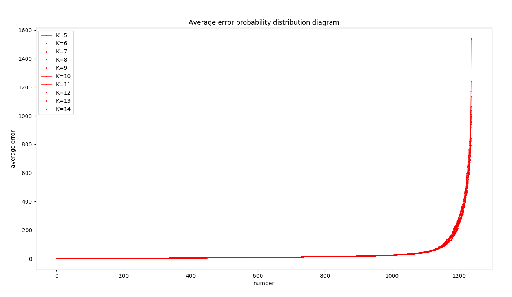
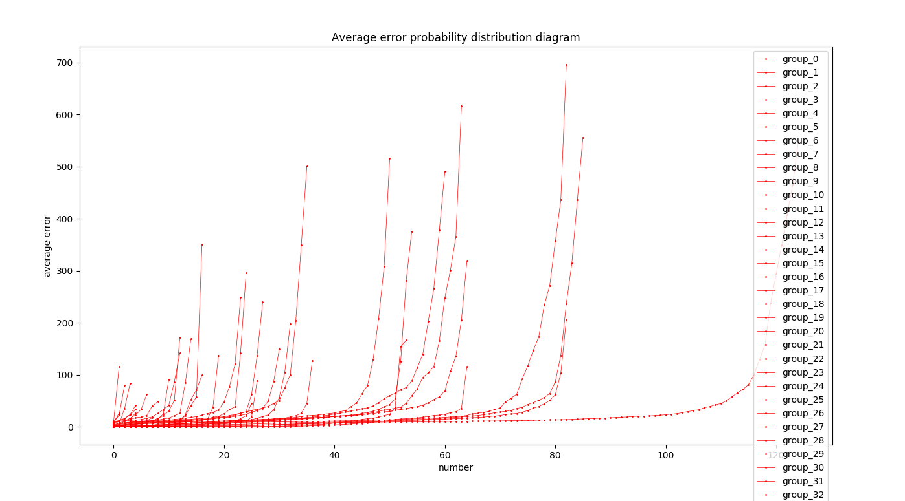
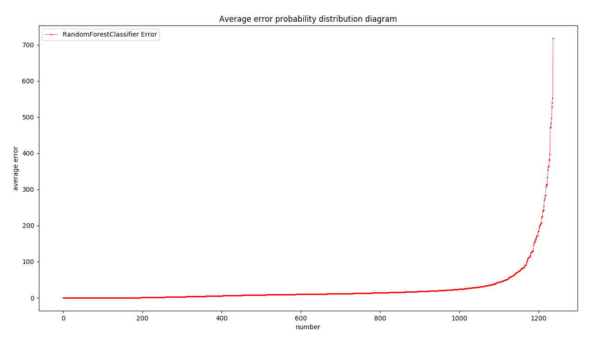
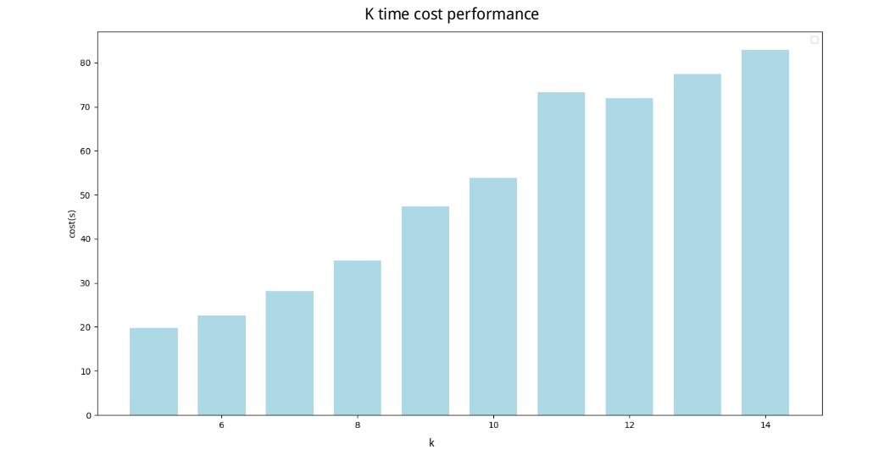

# Report

### 运行结果
##### 结果截屏（总体误差随 k 的取值而变化）

##### 不同 k 值的总体误差

##### 各个组的预测结果误差图

##### 总体的预测结果误差图

#### 性能比较图
##### 各个分类器运行时间比较

#### 讨论分析

##### top-k训练
- 每个分组定位模型的中位误差进行排序，取得中位误差最小的前top-k分组（记为topk+）和中位误差最大的后top-k分组（记为topk-），利用topk+分组中的 MR 数据融入到topk-分组中，并重新进行训练
- 实际在做的过程中，k不宜取大，当k = 16时，误差已经非常大了，所以在测试时，本人选的 k = 5 到 14 进行训练

##### 性能分析

- 由于存在两次训练，程序运行的时间会更长

##### 结果分析

- 分组后，组内点较少的组由于拥有了更多的训练数据，经过训练后，测试的结果相对来说有所提高。
- 相比于 A-c 使用 top-k 在总误差的控制上似乎没有什么优势，甚至还会更差，个人认为，通过 top-k 训练，并没有价值，因为数据本身就不是该组的，拿过来训练可能增大误差，不会有好的效果，这是由分类器的性质决定的。