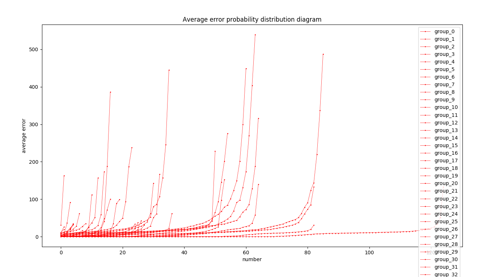
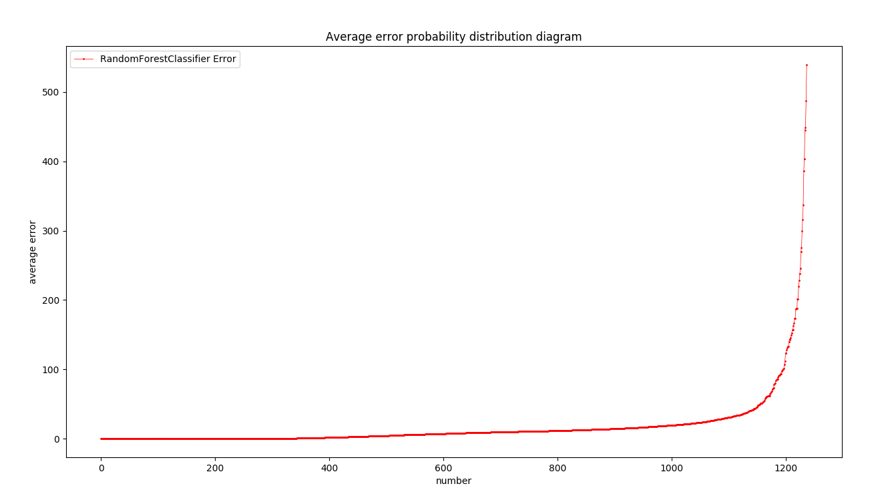

# Report

### 运行结果
##### 各个组的预测结果

##### 各个组的预测结果误差图

##### 总体的预测结果误差图

#### 性能比较图
##### 各个分类器运行时间比较
A-e 随机森林运行时间 39.99 s
A-c 随机森林运行时间为 40+s
#### 讨论分析

##### 解决方案
- 如何构建 MR 分组的相似性？

  根据题目要求，本人通过将主机站的 GPS 进行 k-means 聚类，根据聚类结果，寻找样本数最多的那一类，作为最相似的 top-s 组，并将这些组的 MR 数据融于其他组进行训练，再对测试数据进行评估。
##### 结果分析
- 分组后，组内点较少的组由于拥有了更多的训练数据，经过训练后，测试的结果相对来说有所提高
- 从总结果误差中可以看出，相比于 A-c、A-d 误差减少了一倍，多数点的误差也变得更小，效果比较明显，但还是无法增加准确率，原因在于分类器的局限性，只能将数据归类。