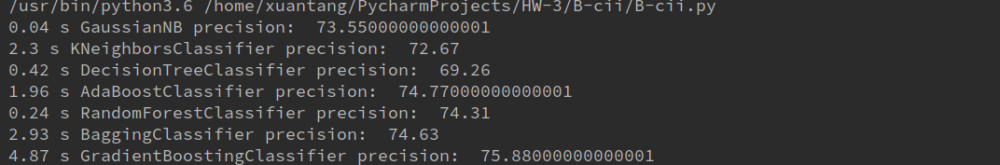
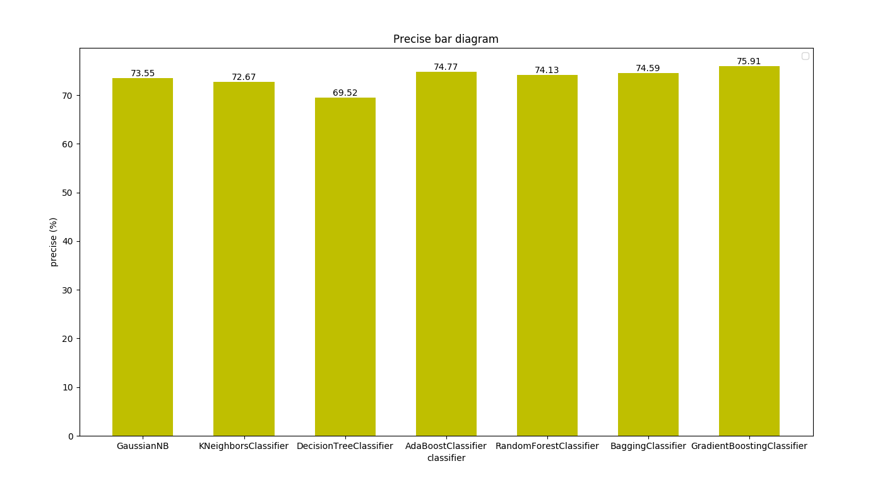
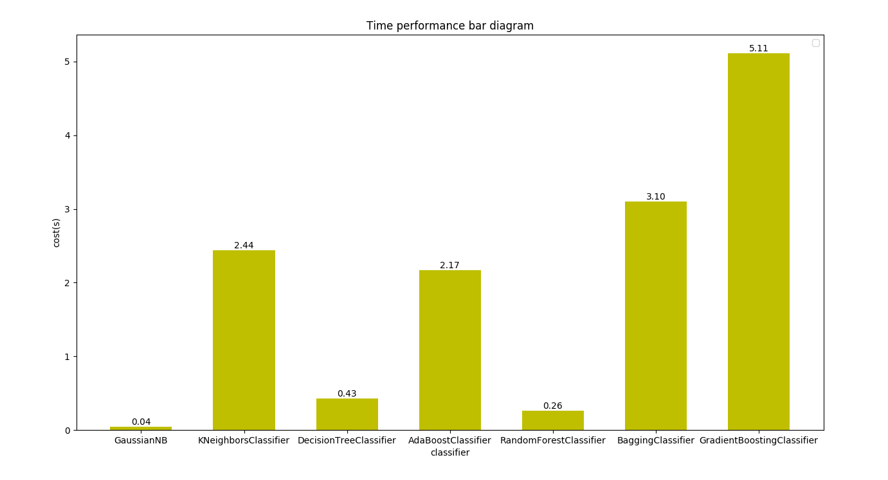

# Report

### 运行结果

##### 代码运行结果截图

##### 准确率结果图

#### 性能比较图

#### 讨论分析

##### 整体解决方案
- 本人采用2、３、４月的数据提取特征，５月的数据作为label，即使用2、 3、 4、 5月的数据做训练集，使用4、 5、 6、 7月的数据作为测试集进行测试
- 此题是根据 user-item ，特征提取来自于 B-a ，经过实际测试，特征越多，训练的效果越好，每种类型的特征都做了部分提取，主要是来自己 vipno，pluno 的集合

##### 性能分析
- 从图中可以看出，高斯贝叶斯的准确率最差，梯度上身准确率最高，达到 80%，其余分类器的结果在 70% 左右
- 从运行时间来看，程序大部分时间用来预处理、特征提取。分类器训练的时间较快

